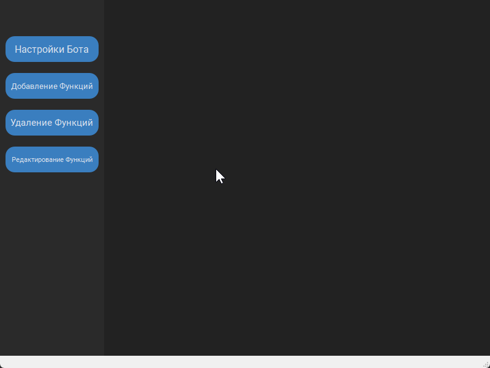
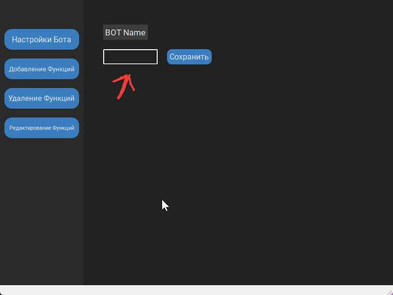
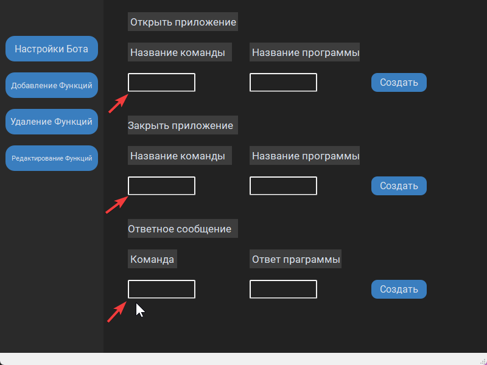
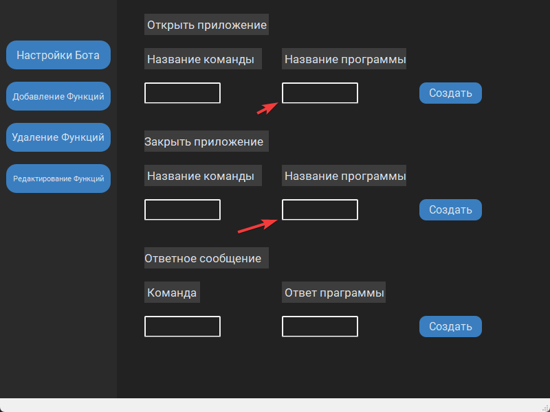
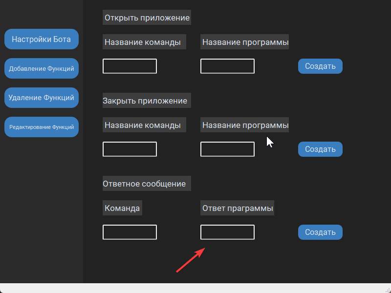
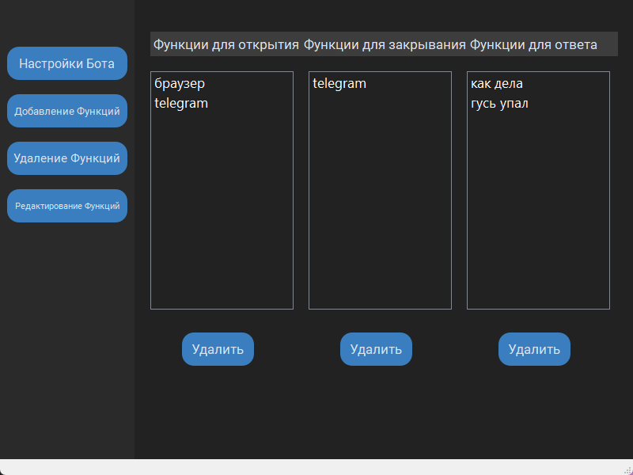
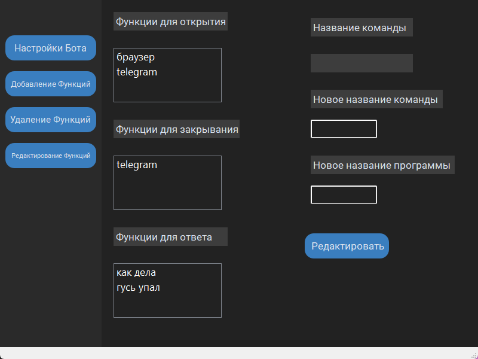

* [Русская версия](#voice-helper)
    * [Что он может](#он-может)
    * [Пользование Ботом](#пользование-ботом)
    * [Пользование окном натроек](#пользование-окном-натроек-бота)
        * [Настройка Бота](#настройка-бота)
        * [Добавление функций](#добавление-функций)
        * [Удаление функций](#удаление-функций)
        * [Редактирование функций](#редактирование-функций)
    * [Что же](#что-же)


# Voice Helper

Это ГС помощник с пока ограниченными возможностями<br>
С помощью дополнительного скрипта вы можете добавлять,<br> редактировать и удалять комманды. Так же можно менять имя бота<br>
по умолчанию его имя <b><i>МАРК</i></b>

#### Он может:
   * Открывать программы
   * Закрывать программы
   * Отвесать н вас запрос по скрипту

Что бы код работал без проблем нужно<br>
```sh
    pip install -r requirements.txt
```
## Пользование ботом

При запуске main.py<br>

В кончоли выведется имя бота и "скажите вашу команду:  ",<br>
Бот слышет всё что вы скажете, но он будет откликаться только<br> если вы сначала скажете его имя и команду
<br>

### Допустим:

-открой Телеграм<br>
бот не исполнит команду

-{Имя бота} открой Телеграм<br>
бот исполнит команду

### Есть пару исключений:

-Привет {Имя бота}<br>
бот ответит вам

-Пока {Имя бота}<br>
бот ваключится(по условию)


## Пользование окном натроек бота

При входе в окно конфигурации вы увидите пустое поле:<br>



Вам нужно выбрать что вы хотите изменить.

### Настройка Бота:

Вводите в поле имя которое вам хочется<br>
и нахмите сохранить.
<br>

### Добавление функций:


В первое поле надо вводить то что вы будете говорить боту<br>
тоесть название команды.



В эти поля водим примерное название программ



В это поле вводим ответ Бота

### Удаление функций:


Выбираем функцию которую хотите удалить и нажимаем кнопку <b>"Удалить"</b>

### Редактирование функций:


Выбираем название функции которую хотим изменить и вводи новые значения

## Что же
При правильно пользовании ботом он будет прикольным помощником<br>
Буду добалять новые возможности и так же фиксить баги<br>
При возникновении ошибок писать сюда <b><i>Телеграм - t.me/Sasmil_Salieri</b></i>